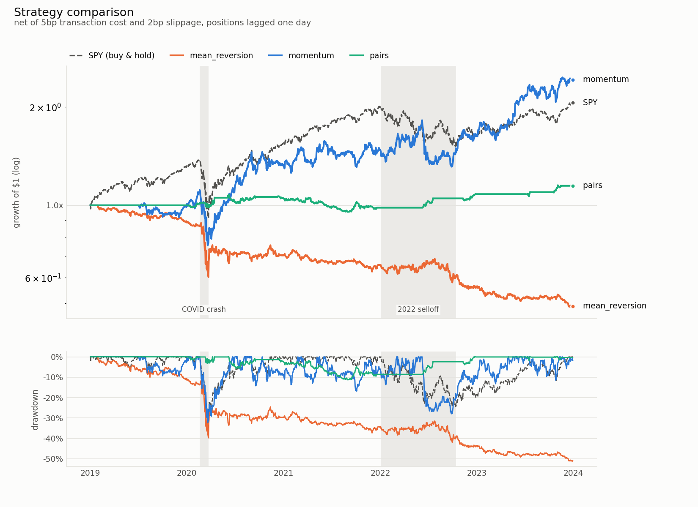
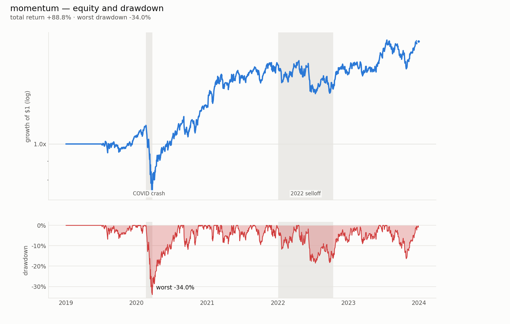
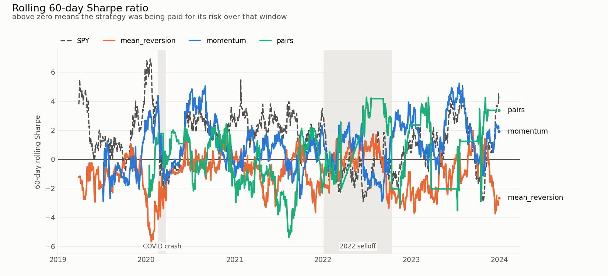

# Vectorized Portfolio Backtesting Engine

[](https://github.com/namesarnav/backtesting-python/actions/workflows/ci.yml)

A daily-frequency backtesting engine for multi-asset equity strategies, built
to demonstrate the things that actually matter in quantitative development:
**correct vectorized computation, explicit handling of look-ahead bias,
realistic transaction cost modelling, and honest out-of-sample validation.**

The headline finding is a negative one, which is the point: of three
classical strategies tested on five years of real US equity data, **none
beats a passive SPY position on a risk-adjusted basis**, and one of them only
looks profitable until it is validated out of sample.

```bash
docker build -t backtest-engine . && docker run --rm backtest-engine
```

That single command reproduces every number and chart below. No API keys, no
network, no manual steps — the price cache is committed.

**[BACKTEST.md](BACKTEST.md)** is the long-form writeup: the decisions behind
each phase, the three bugs that nearly got through, and what building the
engine twice exposed about the first one.

---

## Results

40 liquid US equities across six sectors, 2019-01-02 to 2023-12-29 (1,258
trading days), net of 5bp transaction cost and 2bp slippage, positions lagged
one day.

| strategy | ann return | ann vol | Sharpe | Sortino | max DD | Calmar | **OOS Sharpe** | beta | turnover |
|---|---:|---:|---:|---:|---:|---:|---:|---:|---:|
| mean reversion | −13.33% | 18.05% | −0.70 | −0.97 | −51.2% | −0.26 | **−0.89** | 0.39 | 0.220 |
| momentum | 19.40% | 27.45% | 0.78 | 1.10 | −32.3% | 0.60 | **0.90** | 0.88 | 0.172 |
| pairs | 2.80% | 5.82% | 0.50 | 0.76 | −11.3% | 0.25 | **−0.25** | −0.02 | 0.013 |
| *SPY buy & hold* | *15.60%* | *20.99%* | *0.80* | *1.11* | *−33.7%* | *0.46* | — | *1.00* | — |

`OOS Sharpe` is from walk-forward validation: 5 folds of 504 training days
followed by 126 out-of-sample days, with parameters and pair selection made
on training data only.

### Reading the table

**Momentum earns more than SPY but is not better than SPY.** 19.4% vs 15.6%
looks like a win until you notice the volatility: 27.5% vs 21.0%. Sharpe 0.78
against SPY's 0.80 — it is *worse* per unit of risk. Beta 0.88 says most of
that return is market exposure anyone can buy for free, and an information
ratio of 0.24 says the leftover out-performance is not consistent. The honest
summary is "a leveraged index fund with extra trading costs."

**Pairs trading is the cautionary tale.** Full-sample Sharpe 0.50 looks like a
modest success. Walk-forward Sharpe is **−0.25**. The gap is not noise: it is
the value of having selected GS/JPM as the pair *after seeing the whole
period*. Re-select the pair on each training window and trade the following
six months blind, and the edge disappears. Any pairs backtest that does not
do this is reporting fiction.

**Mean reversion is destroyed by costs, not by being wrong.** It trades
33,751 times at an average daily turnover of 0.22 — roughly 3.9% of capital
per year in fees alone before it is right or wrong about anything. A backtest
without a cost model would have shown something far more flattering, which is
precisely why the cost model exists.

**Only pairs is genuinely market-neutral** — beta −0.02, max drawdown −11.3%
against everyone else's −32% to −51%. It delivers the risk profile it
advertises. It just does not make money out of sample.

---

## Charts

### All strategies vs benchmark



Equity on a log scale so equal percentage moves are equal distances. Shaded
bands mark the 2020 COVID crash and the 2022 selloff — every series reacts to
both, which is a visual sanity check on the data as much as a narrative.

### Momentum, equity and drawdown



The flat first stretch is the 126-day lookback warming up, not a data gap.
Drawdowns land where they should: −32.3% at COVID, and again through 2022.

### Rolling 60-day Sharpe



A single full-sample Sharpe hides *when* a strategy worked. At a 60-day
window every series swings between roughly −6 and +7, which is worth
internalising: short-window Sharpe is extremely noisy, and a strategy
"working" for two months means almost nothing.

---

## Architecture

```
configs/*.yaml          ← universe, strategy registry, cost/lag/walk-forward params
     │
     ▼
engine/data_loader.py   DataLoader
     │                    fetch → split/dividend adjust → Parquet cache → align
     ▼
  price panel           wide DataFrame, dates × (field, ticker) MultiIndex
     │
     ├──────────────► strategies/*.py      generate_signals(panel) → signal panel
     │                   momentum · mean_reversion · pairs
     │                          │
     ├──────────────────────────┤
     ▼                          ▼
engine/backtest.py         engine/event_driven.py
  VectorizedBacktester       EventDrivenBacktester
  whole-table maths          bar-by-bar loop, explicit cash + share state
  normalize → LAG → cost     same weights, filled as orders at the close
     │                          │
     ▼                          ▼
  BacktestResult             EventDrivenResult
  returns · equity_curve ·     ...the same fields, plus
  positions · trades ·         cash · holdings · equity · fill log
  turnover                        │
     │◄───────────────────────────┘
     │      (either result works downstream — same field names)
     ├──► metrics/performance.py   Sharpe, Sortino, max DD, Calmar, win rate, turnover
     ├──► metrics/validation.py    walk-forward folds, SPY benchmark comparison
     └──► viz/plots.py             equity/drawdown, rolling Sharpe, comparison
```

Five design decisions hold the whole thing together:

**One panel shape everywhere.** Prices and signals are both wide DataFrames
with dates as rows and tickers as columns. Because they are identically
shaped, "what I held times what it returned" is a single element-wise
multiply over the entire history — no loops, no reshaping. An AST check in
the test suite confirms `engine/backtest.py` contains zero `for` loops.

**One strategy interface.** Every strategy implements
`generate_signals(price_panel) -> signal_panel`. The engine has no idea which
one it is running; adding a fourth means writing one file and one YAML block,
with no engine change.

**Configuration is not code.** Universe, costs, lag, allocation method and
walk-forward windows live in `configs/*.yaml`.

**Two engines, one allocation step.** The event-driven engine calls the
vectorized engine's `_target_weights`, so the two cannot disagree about *what
to hold* — every difference in their output is attributable to *how it gets
held*. That is what makes comparing them informative rather than noisy.

**The lag is a single, deliberate, commented line.** See below.

---

## Look-ahead bias

A signal computed from day *t*'s closing price cannot be traded on day *t* —
that price does not exist until the market has closed. The engine therefore
holds *yesterday's* target:

```python
return weights.shift(self.lag_days).fillna(0.0)   # engine/backtest.py
```

To show this is not decorative, here is the same three-day toy dataset run
with and without that line:

| | total return |
|---|---:|
| lag removed | **+20.77%** |
| lag present | **−0.07%** |

A losing strategy becomes a 21% winner from one missing `shift()`. The engine
refuses to run with `lag_days=0` rather than offering it as an option, and
`tests/test_backtest.py` fails loudly if the lag is ever removed.

Two subtler forms are handled too:

- **Volatility-based sizing** derives from prices, so it is folded into the
  weights *before* the lag — otherwise it would leak through the back door
  while the signal itself looked correctly lagged.
- **Pair selection** in `strategies/pairs.py` uses a formation window and
  never trades inside it. Choosing a pair over the full history and then
  backtesting on that same history is selection bias, and it is nastier than
  a missing `shift()` because every individual day's arithmetic still looks
  right. The −0.25 out-of-sample Sharpe above is what that costs.

---

## Vectorized vs event-driven

`engine/backtest.py` computes the whole history in a handful of whole-table
operations. `engine/event_driven.py` computes the same history by simulating
it — one bar at a time, holding a cash balance and a share count per ticker,
placing orders that get filled at the close.

Building both was not redundancy. It was the only way to find out what the
fast one was quietly assuming.

### They agree exactly where they must

With costs switched off, the two engines produce **identical gross returns**
to floating-point precision (max difference ~1e-15 over 1,258 days). That is
the assertion worth caring about: gross return is just "what I held times
what it did", with no modelling choices in it. If it diverged, the engines
would be disagreeing about the lag or the allocation, which is a bug rather
than a difference of opinion.

Getting there required fixing a real off-by-one. Filling at the close of bar
*t* means the position established today is exposed to *tomorrow's* move —
the simulation is already one bar lagged, structurally. So `lag_days = 1`
maps to **zero** extra delay in the event loop, and the index offset is
`t - (lag_days - 1)`. Writing the obvious `t - lag_days` double-lags the
entire book: nothing crashes, the equity curve still looks plausible, and the
two engines quietly disagree by one day forever.
`test_positions_match_vectorized` is what pins this down.

### They disagree on cost, and the event-driven engine is right

```
strategy          gross diff  vec return  evt return  vec turnover  evt turnover  cost gap    fills
---------------------------------------------------------------------------------------------------
mean_reversion       1.8e-05     -51.03%     -51.22%        0.2204        0.2251     0.41%   41,527
momentum             5.2e-05     142.38%     140.77%        0.1721        0.1796     0.66%    4,960
pairs                1.2e-05      14.77%      14.19%        0.0127        0.0185     0.51%      956
```

*(`python -m engine.run` prints this table; `gross diff` is above 1e-15 here
only because costs are on — see the third bullet below.)*

Event-driven turnover is higher for every strategy, and the total return is
correspondingly lower. Three distinct mechanisms, in order of how much they
matter:

**1. Weight drift is a trade the vectorized engine cannot see.** The
vectorized engine measures turnover as the change in *target* weights,
`|w[t] − w[t−1]|`. Hold a permanently constant signal and that is zero
forever — it charges for the initial buy-in and nothing after. But holding a
constant *weight* is not holding a constant *position*: prices move
overnight, the weights drift apart, and pulling them back to target is a real
trade that a real broker really bills for. The event-driven engine tracks
shares, so it sees those trades and charges for them.

This shows up most starkly in **pairs**, where reported turnover rises 46%
(0.0127 → 0.0185). Pairs holds a near-static two-leg position, so almost all
of its true trading *is* drift correction — the exact category the vectorized
engine is blind to. The strategy that looked cheapest to trade is the one
whose costs were most understated.

**2. Cost timing.** A trade decided from bar *t*'s close is filled at bar
*t*'s close, so the cash leaves at bar *t*. The vectorized engine charges it
against bar *t+1*, the day the position becomes effective. A one-bar shift in
the cost series — immaterial to the total, visible day by day.

**3. Orders are sized on pre-commission equity.** The commission is not known
until the order exists, so the order is sized off current NAV and the fee
comes out after. The book is therefore a fraction of a basis point above 100%
gross once the fee is paid. This is what a live system does, and it is why
gross returns match *exactly* only at zero cost; with 7bp of costs they agree
to ~1e-5.

None of these reverse a conclusion. Momentum still beats the benchmark on
return and loses on Sharpe; mean-reversion is still bad; pairs is still a
low-volatility, low-return book that fails out of sample. The engines are
directionally consistent, which is the checkpoint. What changed is the
confidence interval around the cost estimate — and the knowledge that it is
biased optimistic in the vectorized engine, by more for low-turnover
strategies than high-turnover ones.

### What each approach is good for

|  | Vectorized | Event-driven |
|---|---|---|
| Unit of thought | weights | shares and cash |
| Speed (40 tickers × 5y) | ~15 ms | ~12–34 ms |
| Can express whole-share orders | no | yes |
| Can express a no-trade band | no | yes |
| Sees weight drift | no | yes |
| Tracks cash | no | yes |
| Could place a live order | no | yes |

The event-driven engine adds two frictions the vectorized one cannot
represent at all, both off by default and both tested:

- `fractional_shares: false` — whole-share orders only. A fixed rounding
  error in dollars, so it dilutes as the account grows;
  `test_whole_share_error_shrinks_with_capital` demonstrates exactly that.
- `rebalance_threshold` — a no-trade band that skips orders below a given
  fraction of equity. The standard fix for drift-driven churn: it cuts
  turnover and cost at the price of letting weights wander from target.

**Why real trading systems are event-driven.** Not for accuracy — for
*identity*. In production the backtest and the live trader must be the same
code path, and a live trader is inherently an event loop: a bar arrives, state
updates, orders go out. A vectorized backtest cannot be run live at all; it
needs the whole future in a DataFrame before it can compute anything. It is
the right tool for research throughput, and it will lie to you about
execution, quietly and in the optimistic direction.

---

## The C++ component

The event-driven bar loop is ported to C++ in `cpp/event_loop.cpp` and bound
with `pybind11`. It is a line-for-line translation of `_simulate_python` —
same variable names, same order of operations — because the point is to
measure the language, not to compare two different algorithms.

The extension is **optional**. Without a compiler the engine falls back to
the Python loop and every number in this repo is unchanged; only the runtime
differs. `python -m engine.run` prints which backend it used.

```bash
python setup.py build_ext --inplace   # builds engine/_fastloop.*.so
python scripts/benchmark_cpp.py       # correctness, then wall clock
```

### Choosing what to port

The tempting target is the vectorized engine's returns aggregation. Porting
it would have been a waste: it is already NumPy, which is already compiled C
with SIMD, so the honest measurement would have been about 1x.

The event-driven loop is the opposite case. It is irreducibly serial — bar
*t+1*'s equity depends on bar *t*'s fills — and in Python each bar pays for
roughly fifteen separate NumPy calls on 40-element arrays. At that size the
per-call cost (allocate a temporary, check dtypes, refcount, return) dwarfs
the ~40 multiply-adds of real arithmetic.

So Phase 6 was not decoration in front of Phase 7. It is what made a real
speedup possible to measure at all.

### Results

Correctness first — a speedup from code that computes something else is not a
speedup. Across all three strategies on the real panel, the largest
disagreement in daily returns is **7.8e-15**, with identical fill counts.
That is float-ordering noise: NumPy reduces pairwise, the C++ loop
accumulates in order, so they differ in the last bit.

```
WALL CLOCK  (real panel: 1,258 bars x 40 tickers)

strategy              python       cpp   speedup     (full run() end to end)
----------------------------------------------------------------------------
mean_reversion       25.06ms    0.53ms     47.2x          27.5ms ->    2.7ms  (10.0x)
momentum              9.51ms    0.34ms     27.6x          11.2ms ->    1.7ms  (6.7x)
pairs                 7.80ms    0.24ms     32.3x           9.7ms ->    1.9ms  (5.2x)
```

Two numbers, on purpose. The loop is what was ported, so **~28–47x** measures
the port. But a user calls `run()`, which also builds a dozen pandas objects
around the loop — constant work C++ never touches — so the end-to-end gain is
**5–10x**. Quoting only the first would overstate what anyone experiences.
(Run-to-run variance across strategies is real; `scripts/benchmark_cpp.py`
regenerates the table.)

### Why the speedup is what it is

Holding bars fixed and varying only the width of the book shows the
mechanism directly:

```
SCALING  (1,258 bars, varying width -- synthetic)

  assets      python       cpp   speedup   python us/bar   cpp us/bar
---------------------------------------------------------------------
       5      9.85ms    0.06ms    168.2x            7.83         0.05
      20     17.86ms    0.29ms     61.8x           14.20         0.23
      40     28.25ms    0.70ms     40.4x           22.46         0.56
     100     61.28ms    1.87ms     32.8x           48.72         1.48
     500    311.68ms   14.57ms     21.4x          247.76        11.58
```

The Python loop pays the same fixed dispatch cost per NumPy call whether the
arrays hold 5 elements or 500, so the narrower the book, the more of the
runtime is pure interpreter tax — and the more there is to remove. At 500
tickers the arrays are finally large enough that NumPy's own arithmetic
dominates, and the gap narrows to 21x.

The claim is therefore not "C++ beats NumPy at arithmetic." It is "C++ does
not pay a dispatch tax fifteen times per bar." That distinction is the whole
result.

### What the port cost

Two things had to change, and both were improvements:

**The fill criterion.** The original loop counted an order as real when the
share delta exceeded an absolute `1e-12`. That is not scale-free — 1e-12
shares of a $1 stock and of a $1000 stock are not the same event — and it
broke the port. Hold one asset at 100% and the target share count is exactly
what you already own, so every bar's delta is float dust sitting right on the
threshold, tipping either way depending on summation order. The two backends
disagreed on the fill count by one. Measuring the order as a *fraction of
equity* puts that dust at ~1e-15, three orders of magnitude clear of the
line, and makes the criterion stable across implementations.

**Tolerances that respect cancellation.** Cash is a residual: equity minus
everything held. In a long/short book those are two ~$2M numbers that nearly
cancel to a balance of a few dollars, so it keeps absolute precision at the
scale of the inputs while its *relative* precision is destroyed. The tests
compare money in dollars and ratios relatively; one tolerance for both would
either fail on cash or wave through a real divergence in the returns.

The loop also releases the GIL, so two backtests can run on two threads.
`test_cpp_backend_releases_the_gil` asserts that by timing it — otherwise
removing the release would break nothing any other test could see.

---

## Running it

### Docker (reproduces everything)

```bash
docker build -t backtest-engine .
docker run --rm backtest-engine
```

To keep the generated charts:

```bash
docker run --rm -v "$PWD/notebooks/results:/app/notebooks/results" backtest-engine
```

### Local

```bash
python3 -m venv .venv && source .venv/bin/activate
pip install -r requirements.txt

python -m engine.run          # full pipeline: table + charts
pytest -q                     # 102 tests
python scripts/make_charts.py # charts only

pip install -r requirements-dev.txt
ruff check .                  # what CI lints with
```

CI runs the same commands on Python 3.11/3.12/3.13, builds the C++ extension
so the backend-equivalence tests actually run, and separately builds and runs
the Docker image.

Optionally build the C++ bar loop. Everything runs without it — the engine
falls back to the Python loop and the results are identical — but it makes
the event-driven engine 5–10x faster end to end:

```bash
python setup.py build_ext --inplace   # needs a C++17 compiler
python scripts/benchmark_cpp.py       # verifies equivalence, then times it
```

The Docker image builds it, so `docker run` always takes the fast path.

### Refreshing the price data

The per-ticker Parquet cache is committed, so this is not normally needed.
Yahoo blocks scripted HTTP clients (429 on every network tested, with or
without cookies or the crumb handshake) while still serving browsers, so the
fetch runs from a browser console:

1. open <https://finance.yahoo.com>
2. paste `scripts/yahoo_browser_fetch.js` into the JavaScript console
3. `mv ~/Downloads/yahoo_panel.json data/`
4. `python -c "from engine.data_loader import DataLoader; DataLoader().ingest_browser_panel('data/yahoo_panel.json')"`

---

## Limitations

Stated plainly, because a backtest that does not list these is hiding them.

- **Survivorship bias.** The universe is 40 companies that are listed *today*.
  Firms that went bankrupt or were delisted over 2019–2023 are absent, so
  every strategy here — and the SPY benchmark — is measured on a sample that
  survived by construction. This flatters all results.
- **Daily data only.** No intraday prices, no order book, no microstructure.
  Fills are assumed at the adjusted close.
- **Costs are a flat basis-point model.** Real costs vary with size, liquidity
  and urgency, and market impact grows with position size. A strategy trading
  size would face worse fills than 7bp.
- **No borrow costs or shorting constraints.** Short positions are assumed
  freely available and free to hold. Neither is true, especially for the names
  a mean-reversion strategy wants to short.
- **No risk-free rate.** Sharpe and Sortino use a 0% hurdle. Over 2019–2023,
  rates went from ~2.4% to ~5%, so real risk-adjusted numbers are *worse* than
  those shown.
- **Pairs re-selection is fixed per fold, not rolling.** Within a fold, the
  pair is chosen once from the formation window. A production system would
  re-select continuously.
- **Five years is a short sample.** It contains one crash and one bear market.
  Five folds of walk-forward is enough to catch gross overfitting, not enough
  for statistical confidence.
- **A backtest is not live performance.** No slippage from latency, no partial
  fills, no exchange outages, no risk limits, no capital constraints.

---

## Repo layout

```
configs/     universe, strategy registry, backtest parameters (YAML)
data/cache/  committed per-ticker Parquet price cache
engine/      data_loader.py · backtest.py · event_driven.py · run.py
strategies/  base.py · momentum.py · mean_reversion.py · pairs.py
metrics/     performance.py · validation.py
viz/         plots.py
cpp/         event_loop.cpp (optional pybind11 extension)
scripts/     yahoo_browser_fetch.js · make_charts.py · benchmark_cpp.py
tests/       102 tests
.github/     CI: lint, tests on 3.11-3.13, Docker build
notebooks/results/   generated charts and results table
```

## Status

- [x] Phase 0 — Scope & setup
- [x] Phase 1 — Data layer
- [x] Phase 2 — Vectorized core engine
- [x] Phase 3 — Strategies
- [x] Phase 4 — Metrics & evaluation
- [x] Phase 5 — Visualization
- [x] Phase 6 — Event-driven backtester *(stretch)*
- [x] Phase 7 — C++ performance component *(stretch)*
- [x] Phase 8 — Polish & ship

---

## License

MIT — see [LICENSE](LICENSE).
